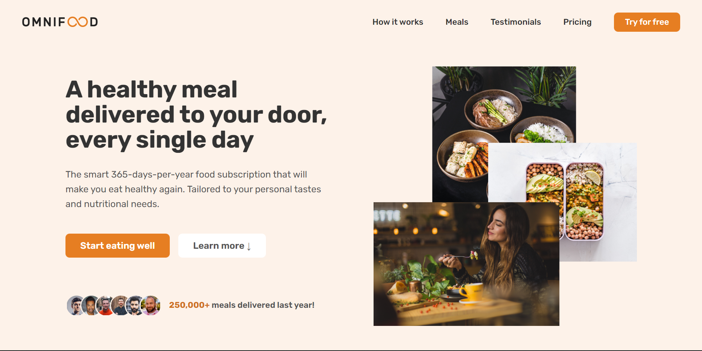

# Omnifood

The omnifood amazing website project built with HTML and CSS and java-script

## Description

The project is made using Flex-box and grid layout in addition to soma javascript code and it contain:

## Getting Started

* Hero section
* featured in section
* how it works section
* meals section
* testimonials section
* pricing section
* call to action section
* footer

🔗Omnifood  [https://omnifood-amar.netlify.app]

## Authors

Contributors names and contact info

ex. Amar yasser
